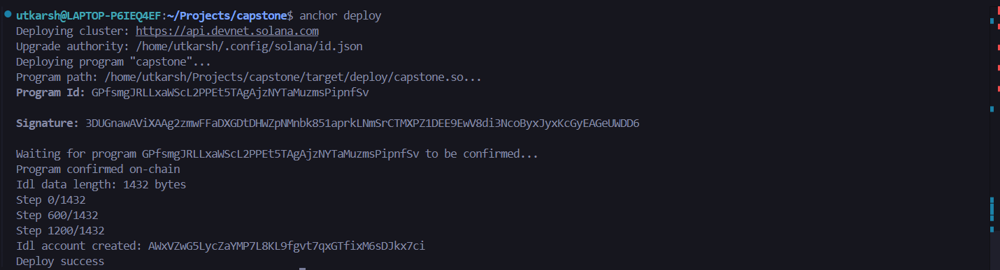
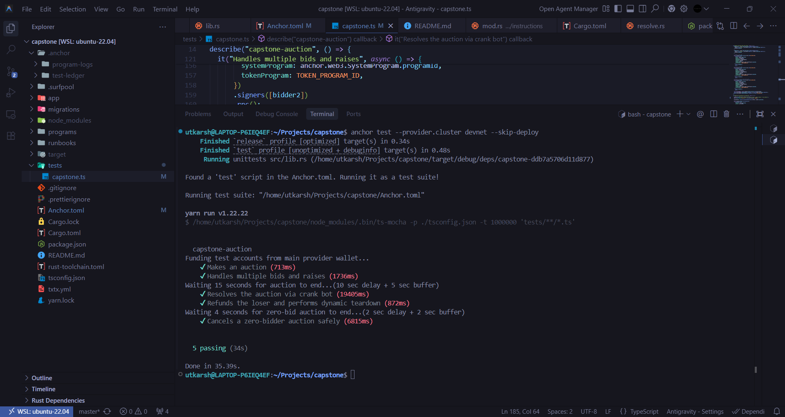

# Solana auction program built using Anchor.

## Live Devnet Deployment
**Program ID:** `GPfsmgJRLLxaWScL2PPEt5TAgAjzNYTaMuzmsPipnfSv`

## Architecture & Core Features

* **`MakeAuction`**: Maker initializes the Auction PDA and securely locks their NFT into a Program-Derived Token Vault.
* **`Bid`**: Bidders deposit Bids into a shared Vault. The protocol uses lazy initialization (`init_if_needed`) for bidder records and updates the leaderboard entirely on-chain.
* **`ResolveAuction`**: A permissionless "Crank" function. Once the timer expires, anyone can pay the transaction fee to distribute the NFT to the winner and the locked Bids to the Maker.
* **`ClaimRefund`**: Losing bidders withdraw their locked Bids. The final user to withdraw triggers a **Dynamic Teardown**, automatically destroying the empty vaults and Auction PDA to return rent lamports to the Maker.
* **`CancelAuction`**: An edge-case safeguard allowing the Maker to reclaim their NFT and close all accounts if the auction expires with zero bids.

### High-Level System Flow

### Test Results

